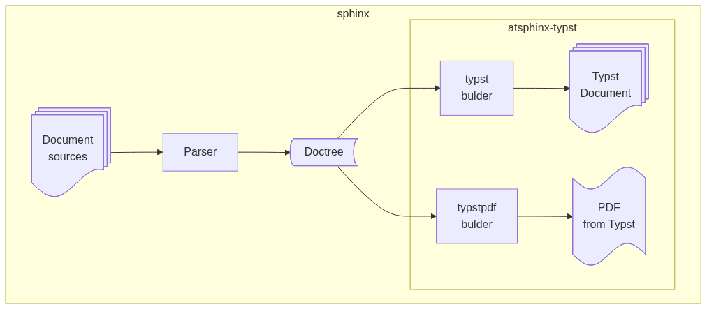

========
Overview
========

What is this
============

This is Sphinx extension to provide custom builders
that covert doctree to Typst document and PDF.

This will increase scenes using Sphinx for documentation.

About Typst
-----------

Typst is a new markup-based typesetting system for the sciences. [#]_
It has easy syntax to learn and lightweight builder to generate PDF.

They design it to be alternative LaTeX.

.. [#] https://typst.app/docs/

Providing features
------------------

Role of atsphinx-typst is that **provides custom builders** using Typst.
There are some internal modules and packages, but they are for providers.

* ``typst`` builder generate Typst document from Sphinx document.
* ``typstpdf`` builder generate Typst document from Sphinx document too.
  After generatating Typst document, it generate PDF document from Typst document using compiler.

..
    TODO: Change sphinxcontrib-mermaid

    Supporting range of atsphinx-typst in Sphinx build process.

Motivation
==========

I publish "Tech-ZINE" [#]_ using Sphinx and ``latexpdf`` builder.

.. [#] It means non-commercial publications about engineerings.

Currently, Sphinx can create PDF document easily because it provides official docker image.
But, I think that it has some problems.

* Image size is too large.
* It is little hard to use image with other extensions.
* It is very hard to build without using docker image.

I want to create PDF as easy and low-layer as possible.
So, I try to adopt Typst as PDF builder that can run without container layer.

Goal
====

As above, this is personal project from private motivation.
But, I think that it should have goal of project.

I set three goals as milestone.

For v0.1.0
----------

In this version:

* We can use to generate Tech-ZINE PDF file.
* We can use to generate PDF file of some Python project.
* I can use to generate simple PDF file of this project. (disabled apidoc)

For v1.0.0
----------

In this version:

* We can use to generate PDF file supported all Sphinx core features and bundle extensions.
* I can replace from ``latexpdf`` build for some my projects published on readthedocs.

  * sphinx-revealjs
  * oEmbedPy

